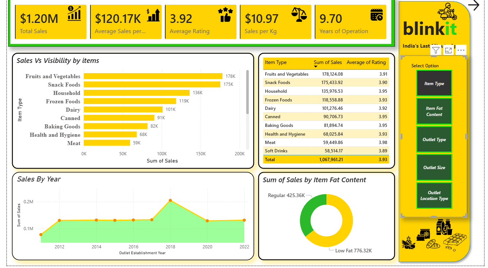
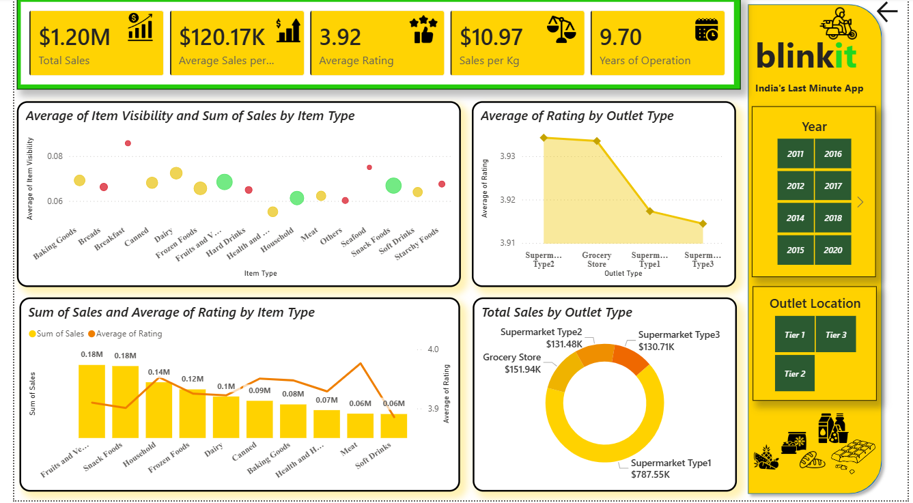
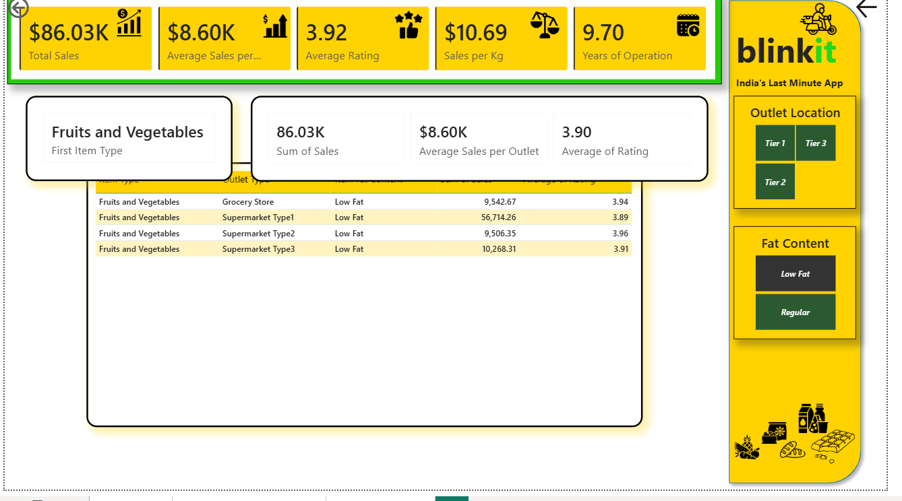

**📊📦 Blinkit Sales Performance & Operational Analysis**

**Project Overview**

This project presents a robust Business Intelligence solution aimed at evaluating Blinkit’s sales trends, customer satisfaction levels, and inventory allocation. Drawing from my experience as a Texturing Artist, I emphasized visual clarity and precision to design an intuitive, high-impact dashboard. The solution transforms complex grocery datasets into meaningful insights, enabling data-driven decision-making at an executive level.

**Tech Stack**

**Analytics Tool:** Power BI Desktop

**Data Modeling**: Star Schema (Fact and Dimension Tables)

**Logic:** Advanced DAX (Dynamic KPIs, Year-over-Year Analysis)

**Visualization**: User-centric UI/UX design with clear, high-contrast metrics for enhanced readability

**📊 Core Business KPIs**

I designed a centralized executive summary to deliver a real-time snapshot of overall business performance:

**Total Sales:** ₹1.20M — Reflects the total revenue generated across all outlets.
 
 **Average Sales per Outlet:** ₹120.17K — Evaluates outlet-level performance and operational efficiency.

**Average Sales per Order:** ₹140.99 — Represents the average customer basket value.

**Average Rating:** 3.92 — Indicates overall customer satisfaction and service quality.

**Years of Operation**:9.70— Highlights business longevity and market presence.

# Interactive Dashboard View

# Executive Sales Overview

# Analytical Insights View

# Drill-Down Insights

# 📊 Business Deep-Dive & Advanced Insights
**1. Strategic Inventory Segmentation****

This analysis evaluates sales performance across 16 distinct product categories to uncover high-impact segments.

**Top Categories:** Fruits & Vegetables (₹178K) and Snack Foods (₹175K) emerge as the leading revenue contributors.
Fat Content Analysis: Sales were segmented into Low Fat and Regular categories across outlet tiers. The findings show that Tier 3 outlets dominate Regular fat product sales (₹307K), indicating strong regional differences in consumer preferences.

**2. In-Depth Drill-Down Analysis**:To transition from summary-level insights to operational clarity, a dedicated deep-dive view was developed:

**Functionality:** Users can interactively navigate from summary visuals into detailed performance views by selecting specific Item Types or Outlets.

**Granular Insights:** The analysis breaks down performance by Outlet Type (Grocery Stores vs. Supermarkets), aligning sales metrics with customer ratings to pinpoint areas of strength and improvement.

**3. Operational Visibility & Efficiency**
A scatter/bubble visualization was used to analyze the relationship between product visibility and sales performance:

**Key Insight:** Identification of “Hidden Stars” — products with low visibility but high sales potential — suggesting opportunities for better placement and promotion.

**Outlet Efficiency:** Supermarket Type 1 stands out by managing the highest item volume (5,577) and generating the maximum revenue (₹787.55K), making it the most scalable and efficient outlet format.

# 🚀 Strategic Recommendations

Based on the insights derived, the following actions are recommended:

**Expansion Strategy:** Focus on scaling the Supermarket Type 1 model due to its strong performance in both volume and revenue.

__Smart Inventory Planning:__ Increase stock allocation for Fruits & Vegetables in Tier 3 outlets where demand is significantly higher.

**Customer Experience Improvement:** Investigate Supermarket Type 3 outlets, as they show comparatively lower ratings despite strong sales performance, indicating potential service gaps.

